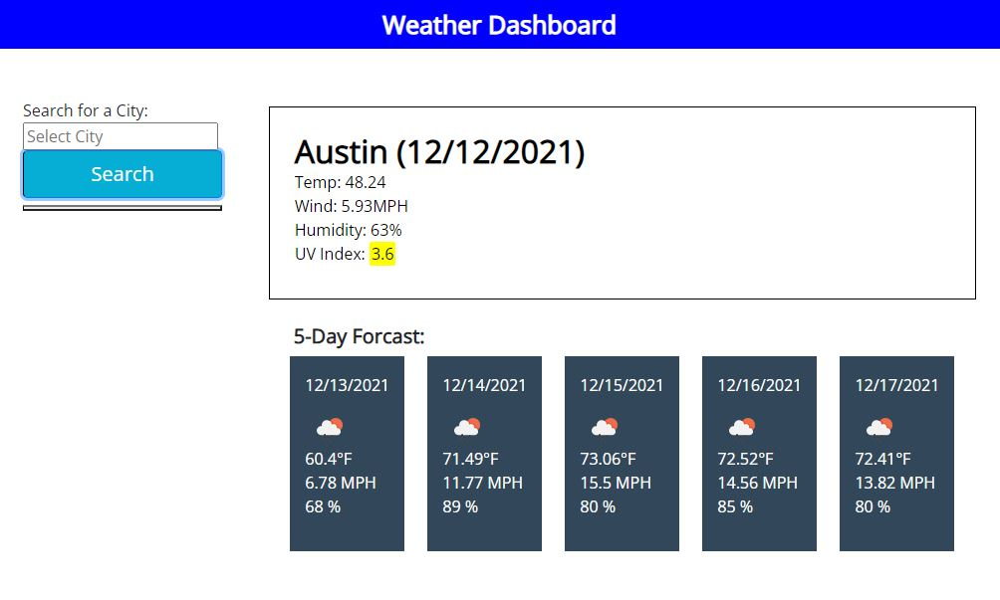

# Weather-app
## Description:
This application shows the weather outlook for multiple cities so that the user can plan a trip accordingly. The user can search a city and is presented with current and future conditions for that city. That city is also added to the search history. The city weather conditions include the city name, date, weather conditions, temperature, humidity, wind speed, and UV index.

## Table of Contents:

* [Installation](#installation)
* [Usage](#usage)
* [Questions](#questions)

## Installation
The user will open the application in the browser and search a given city in the United States. If the user would like to go back and view previous searches, they can search the city again or click the city button below the search bar.

Languages used: JavaScript,HTML,CSS 

## Usage
Depolyed App
https://chellesjord.github.io/weather-app/

## Questions:
Check out my [GitHub page](https://github.com/chellesjord)!

If you have additonal questions email me at 
<a href="mailto:m.kayejordan@gmail.com">m.kayejordan@gmail.com</a>.